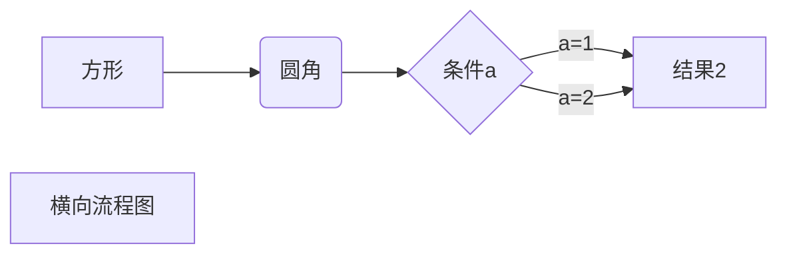

```js
var num = 0;
mermaid.initialize({ startOnLoad: false });

window.$docsify = {
  markdown: {
    renderer: {
      code: function(code, lang) {
        if (lang === "mermaid") {
          return (
            '<div class="mermaid">' + mermaid.render('mermaid-svg-' + num++, code) + "</div>"
          );
        }
        return this.origin.code.apply(this, arguments);
      }
    }
  }
}
```